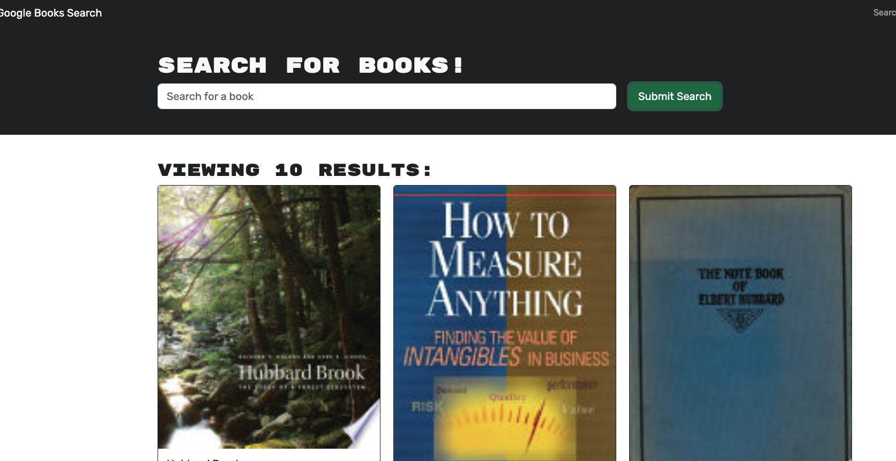

Book Search Engine

A full-stack MERN application refactored to use GraphQL with Apollo Server and Client. Users can search for books via the Google Books API, create an account, and save books to their profile.

---

## 🚀 Live Links

- **Frontend App:** [https://booksearch-rbyz.onrender.com](https://booksearch-rbyz.onrender.com)
- **GraphQL Backend Endpoint:** [https://book-backend-lgzm.onrender.com/graphql](https://book-backend-lgzm.onrender.com/graphql)

---

## 🧰 Technologies Used

- MongoDB Atlas
- Express.js
- React (Vite)
- Node.js
- GraphQL + Apollo Server & Client
- JSON Web Tokens (JWT)
- Google Books API

---

## 🔐 Features

- Search for books using the Google Books API
- Create a user account and log in
- Save books to your personal list
- Delete saved books
- Authenticated routes using JWT
- Fully deployed to Render

---

## 📸 Screenshots



---

## 🔧 Installation (Local)

1. Clone the repository:

```bash
git clone https://github.com/your-username/book-search-engine.git
cd book-search-engine
Install dependencies for both client and server:

bash
Copy
Edit
cd server
npm install

cd ../client
npm install
Create a .env file in /server with:

env
Copy
Edit
MONGODB_URI=your_mongo_uri
JWT_SECRET=your_jwt_secret
Run the development server:

bash
Copy
Edit
# In one terminal
cd server
npm run dev

# In another terminal
cd client
npm run dev
📁 Folder Structure
pgsql
Copy
Edit
/client - React frontend with Apollo Client
/server - Node/Express backend with Apollo Server
👨‍💻 Team
Built by Ervey García as part of Full-Stack Bootcamp Challenge 18.

✅ Challenge Criteria Fulfilled
✔ Apollo Server replacing REST API

✔ Auth with JWT

✔ GraphQL queries and mutations

✔ Apollo Client in frontend

✔ Book saving/removal

✔ Deployment on Render